<!--
  Bento profile. The tiles in assets/ are generated:
    edit the DATA section in scripts/build_cards.py, then run  python3 scripts/build_cards.py
  Stats cards (profile-summary-card-output/) and the 3D graph (profile-3d-contrib/) are made by GitHub Actions.
  Rows line up because the widths match each tile's shape: 100% | 65.8% + 32.9% | 49.4% + 49.4% | 32.6% x 3
-->

  

  
  

  

  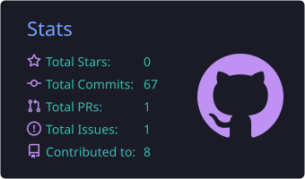
  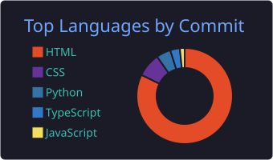
  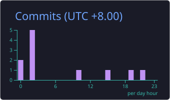

<!-- PROJECTS: private repos (TakeNote, GeoCrimeMap, Web LMS) don't link to the repo, visitors would get a 404 -->

  <a href="https://github.com/xenutheflock/quest-runner"></a>

  <a href="https://takenote.fun"></a>
  <a href="https://dtr-calculator-five.vercel.app"></a>

  
  

  <a href="https://github.com/xenutheflock/campus-essentials"></a>

  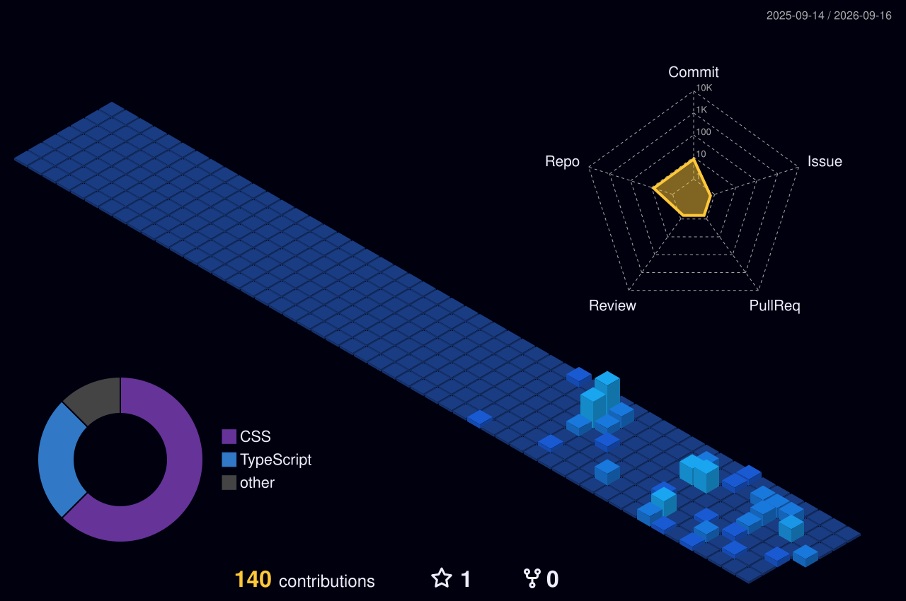

<!-- CONTACT: Discord links need your numeric user ID, e.g. <a href="https://discord.com/users/123456789012345678"> -->

  <a href="mailto:edzel.wcc@gmail.com"></a>
  
  <a href="https://facebook.com/idzill"></a>

  <picture>
    <source media="(prefers-color-scheme: dark)" srcset="https://raw.githubusercontent.com/xenutheflock/xenutheflock/output/github-snake.svg" />
    <source media="(prefers-color-scheme: light)" srcset="https://raw.githubusercontent.com/xenutheflock/xenutheflock/output/github-snake-light.svg" />
    
  </picture>

